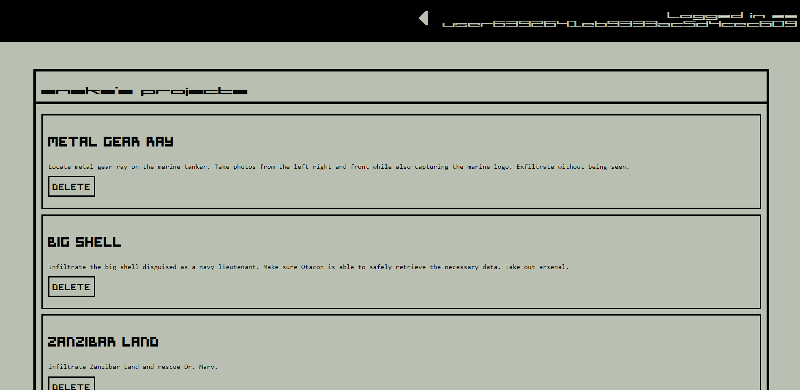

# sprite-planner

This project was made as an effort to practice my full stack skills as I've just finished my coding bootcamp. Additonally I wanted to test my skills with vanilla CSS as in the past I've relied heavily on Bootstrap.

## Check out the Project

Check out the different aspects of the project below:

- [Heroku Deployment](https://sprite-planner.herokuapp.com/)
- [Repository](https://github.com/johnathanmann/sprite-planner)

## Design Process

The UI design of this site was 100% inspired by that of the photo viewer in Metal Gear Solid 2 which was created in universe by Hal "Otacon" Emmerich. The whole Metal Gear series has a lot of UI design I love, especially Metal Gear Solid 3. I figured Otacon, a computer programer and engineer, could have used a site like this himself in his own programming endeavors. During some of the font searching I did for this prject I found this cool blog post about the intent of font in MGS check it out [here](https://metalgearstuff.wordpress.com/2020/01/29/the-fonts-of-metal-gear-solid/) if your interested!

Fonts:  
[MGS2 Menu Font](https://fontmeme.com/fonts/mgs2-menu-font/) 
[Symtext](https://www.dafont.com/symtext.font?text=Project+Title%3A) 
[Roboto](https://fonts.google.com/specimen/Roboto?category=Serif,Sans+Serif) 

## Summary
This site allows you to login and signup for a project planning program. Use the site to keep track of your project ideas, and mark them off apon completion.
